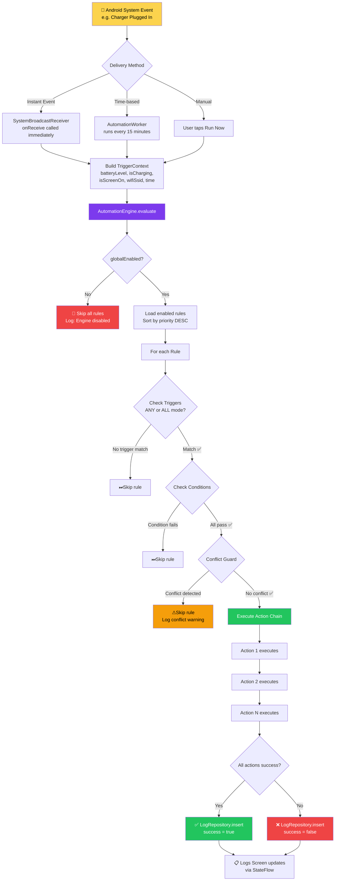

<div align="center">


<br/>


<br/><br/>

<!-- TIER 1 BADGES -->
[](https://developer.android.com)
[](https://kotlinlang.org)
[](https://m3.material.io)
[](https://developer.android.com/topic/architecture)

<br/>

<!-- TIER 2 BADGES -->
[](https://developer.android.com/training/data-storage/room)
[](https://developer.android.com/topic/libraries/architecture/workmanager)
[](https://kotlinlang.org/docs/coroutines-overview.html)
[](https://github.com/google/gson)

<br/>

<!-- TIER 3 BADGES -->
[](LICENSE)
[](CONTRIBUTING.md)
[](https://kotlinlang.org)
[](https://android.com)

<br/>

<!-- LIVE STATS -->


<br/><br/>

---

### *"NexusFlow isn't just another automation app.*
### *It's a software architecture showcase disguised as a productivity tool."*

---

</div>

<br/>


## Demo

<div align="center">

> ### Watch NexusFlow work in real-time
> **[Click here to watch the full demo](https://drive.google.com/file/d/10fnH_EVTMMjkYa1ymxFaT7KzJ6wgKsjv/view?usp=drivesdk)**


</div>

---

## Screenshots

---

### Onboarding

<div align="center">

<br/><br/>
<i> First impression — Solar Dark splash screen with animated engine status</i>
</div>

---

### Three Premium Themes — Pick Your Vibe

<div align="center">

| Solar Dark | Fire Dark | Pastel Dark |
|:---:|:---:|:---:|
|  |  |  |
| *Electric yellows* | *Glowing reds* | *Soft purples* |
| *Deep black bg* | *Volcanic black bg* | *Dreamy dark bg* |

> *One app. Three personalities. Switch themes instantly.*

</div>

---

### Building Your First Automation

<div align="center">

> *Four steps. One powerful rule. Runs forever in the background.*

| Create Flow | Select Trigger | Set Condition | Pick Action |
|:---:|:---:|:---:|:---:|
|  |  |  |  |
| *Name your rule* | *Choose WHEN* | *Set ONLY IF guard* | *Define THEN* |

</div>

---

### Manage Rules & Track Everything

<div align="center">

| Rule Cards Dashboard | Execution Logs |
|:---:|:---:|
|  |  |
| *All rules at a glance · toggle · priority* | *Every automation logged · timestamped · tracked* |

</div>

---

## The Philosophy

<div align="center">

```
╔══════════════════════════════════════════════════════════════════════╗
║                                                                      ║
║   Your phone is the most powerful computer you carry every day.      ║
║   Yet you manually dim the screen when the battery is low.           ║
║   You manually silence your phone when you sleep.                    ║
║   You manually turn up brightness when you plug in the charger.      ║
║                                                                      ║
║   You do this.   Every.   Single.   Day.                             ║
║                                                                      ║
║   NexusFlow ends that.   Permanently.                                ║
║                                                                      ║
╚══════════════════════════════════════════════════════════════════════╝
```

```
🔋 Battery hits 15%    ─────►  ⚡ NexusFlow fires  ─────►  📢 Notify + 🌑 Dim + 📝 Log
🔌 Charger connected   ─────►  ⚡ NexusFlow fires  ─────►  ☀Bright + 🔊 Volume + 📝 Log
🌙 Clock hits 22:00    ─────►  ⚡ NexusFlow fires  ─────►  🔇 Silent + 🌑 Dim + 📝 Log
📱 Screen turns OFF    ─────►  ⚡ NexusFlow fires  ─────►  📳 Vibrate + 📝 Log

                    S E T   I T.     F O R G E T   I T.
```

</div>


## Complete Feature Set

<details>
<summary><b> 9 Triggers — The "WHEN" of every rule</b></summary>

<br/>

| # | Trigger | System Event Listened | Delivery Method |
|---|---------|----------------------|-----------------|
| 1 | Battery Level | `ACTION_BATTERY_CHANGED` | BroadcastReceiver |
| 2 | Charger Connected | `ACTION_POWER_CONNECTED` | BroadcastReceiver |
| 3 | Charger Disconnected | `ACTION_POWER_DISCONNECTED` | BroadcastReceiver |
| 4 | Time of Day | System Clock | WorkManager periodic |
| 5 | Screen ON | `ACTION_SCREEN_ON` | BroadcastReceiver |
| 6 | Screen OFF | `ACTION_SCREEN_OFF` | BroadcastReceiver |
| 7 | WiFi Connected | `ConnectivityManager` callback | NetworkCallback |
| 8 | WiFi Disconnected | `ConnectivityManager` callback | NetworkCallback |
| 9 | Interval | Custom timer | WorkManager |

</details>

<details>
<summary><b> 8 Actions — The "THEN" of every rule</b></summary>

<br/>

| # | Action | Android API Used | Special Permission |
|---|--------|-----------------|-------------------|
| 1 | Show Notification | `NotificationManager` | `POST_NOTIFICATIONS` |
| 2 | Set Volume | `AudioManager.setStreamVolume()` | `MODIFY_AUDIO_SETTINGS` |
| 3 | Set Brightness | `Settings.System.SCREEN_BRIGHTNESS` | `WRITE_SETTINGS` |
| 4 | Vibrate | `VibrationEffect.createOneShot()` | `VIBRATE` |
| 5 | Log Event | `LogRepository.insert()` | None |
| 6 | Send Broadcast | `context.sendBroadcast()` | None |
| 7 | Toggle WiFi | `WifiManager` | `CHANGE_WIFI_STATE` |
| 8 | Launch App | `PackageManager.getLaunchIntentForPackage()` | None |

</details>

<details>
<summary><b>5 Conditions — The "ONLY IF" guard layer</b></summary>

<br/>

| # | Condition | Logic | Real World Use Case |
|---|-----------|-------|-------------------|
| 1 | Battery Below | `level < threshold` | "Only dim screen if battery truly critical" |
| 2 | Battery Above | `level > threshold` | "Only launch app if enough charge" |
| 3 | Time Between | `start ≤ now ≤ end` | "Only silent mode during work hours" |
| 4 | WiFi Is | `ssid == expected` | "Only log if on home network" |
| 5 | Screen State | `isOn == expected` | "Only vibrate if screen is off" |

</details>

---

## Architecture — The Full Picture

NexusFlow is built on a strict **3-layer clean architecture** with a dedicated background processing layer.

```
┌─────────────────────────────────────────────────────────────────────┐
│                         UI LAYER                                    │
│                                                                     │
│   ┌───────────────────┐  ┌──────────────────┐  ┌────────────────┐  │
│   │  RulesFragment    │  │CreateRuleFragment│  │  LogsFragment  │  │
│   │  + RulesAdapter   │  │                  │  │  + LogsAdapter │  │
│   └────────┬──────────┘  └────────┬─────────┘  └───────┬────────┘  │
│            │    ViewBinding        │                    │           │
│   ┌────────▼──────────┐  ┌────────▼─────────┐  ┌───────▼────────┐  │
│   │  RulesViewModel   │  │CreateRuleViewModel│  │ LogsViewModel  │  │
│   └────────┬──────────┘  └────────┬─────────┘  └───────┬────────┘  │
│            └──────────────────────┼────────────────────┘           │
│                         StateFlow / Flow                            │
├─────────────────────────────────────────────────────────────────────┤
│                       DOMAIN LAYER                                  │
│                                                                     │
│   ┌──────────────────────────────────────────────────────────────┐  │
│   │                   AutomationEngine                           │  │
│   │                                                              │  │
│   │  globalEnabled: Boolean ──► if false, skip all evaluation   │  │
│   │                                                              │  │
│   │  evaluate(context: TriggerContext) {                         │  │
│   │    rules                                                     │  │
│   │      .filter { it.isEnabled }                                │  │
│   │      .sortedByDescending { it.priority }   ← Priority sort  │  │
│   │      .forEach { rule →                                       │  │
│   │          checkTriggers(rule, context)       ← Strategy       │  │
│   │          checkConditions(rule, context)     ← Guard layer    │  │
│   │          checkConflicts(rule)               ← Conflict check │  │
│   │          executeActions(rule, context)      ← Chain execute  │  │
│   │          logResult(rule)                    ← Always logged  │  │
│   │      }                                                       │  │
│   │  }                                                           │  │
│   └──────────────────────────────────────────────────────────────┘  │
│                                                                     │
│   ┌───────────────┐  ┌────────────────┐  ┌────────────────────────┐ │
│   │  TriggerFactory│  │ ActionFactory  │  │  ConditionFactory      │ │
│   │  9 strategies  │  │  8 strategies  │  │  5 strategies          │ │
│   └───────────────┘  └────────────────┘  └────────────────────────┘ │
├─────────────────────────────────────────────────────────────────────┤
│                        DATA LAYER                                   │
│                                                                     │
│   ┌─────────────────────────┐    ┌──────────────────────────────┐   │
│   │     RuleRepository      │    │       LogRepository          │   │
│   │                         │    │                              │   │
│   │  observeAllRules(): Flow│    │  observeRecentLogs(): Flow   │   │
│   │  save(rule: Rule)       │    │  insert(log: LogEntry)       │   │
│   │  delete(id: String)     │    │  clearAll()                  │   │
│   │  setEnabled(id, bool)   │    │  pruneOldLogs(days: Int)     │   │
│   └────────────┬────────────┘    └──────────────┬───────────────┘   │
│                │                                │                   │
│   ┌────────────▼─────────────────────────────────▼───────────────┐  │
│   │                    AppDatabase (Room)                        │  │
│   │                                                              │  │
│   │   TABLE: rules    ←──── RuleDao                              │  │
│   │   TABLE: logs     ←──── LogDao                               │  │
│   └──────────────────────────────────────────────────────────────┘  │
├─────────────────────────────────────────────────────────────────────┤
│                    BACKGROUND LAYER                                 │
│                                                                     │
│   ┌────────────────────────────┐  ┌─────────────────────────────┐   │
│   │   SystemBroadcastReceiver  │  │      AutomationWorker       │   │
│   │                            │  │                             │   │
│   │  Listens for:              │  │  Runs: every 15 minutes     │   │
│   │  • POWER_CONNECTED         │  │  Handles: time-based rules  │   │
│   │  • POWER_DISCONNECTED      │  │  Survives: app being closed │   │
│   │  • BATTERY_LOW             │  │                             │   │
│   │  • SCREEN_ON               │  │  Uses WorkManager for:      │   │
│   │  • SCREEN_OFF              │  │  • Battery optimization     │   │
│   │                            │  │  • Doze mode survival       │   │
│   │  Reacts: INSTANTLY         │  │  • Reliable scheduling      │   │
│   └────────────────────────────┘  └─────────────────────────────┘   │
└─────────────────────────────────────────────────────────────────────┘
```

---

## Event Flow Diagram

> *This is the exact journey of a single system event through NexusFlow — from the moment Android fires it, to the user seeing it in logs.*



---

## Software Design — SOLID + Patterns

### The Strategy Pattern — Heart of the Engine

> *"I deliberately chose the Strategy Pattern for Triggers, Actions, and Conditions to ensure NexusFlow's engine is infinitely extensible. A future developer can add a brand new trigger type by creating a single new class — zero changes required to the engine, zero risk of regression. This is textbook Open/Closed Principle."*
> — K. Karthikeya, Author

```kotlin
// ── THE CONTRACT (Interface) ──────────────────────────────────────
interface Action {
    val type: ActionType
    val parameters: Map<String, String>
    suspend fun execute(context: Context): ActionResult  // Strategy method
    fun describe(): String
}

// ── THE STRATEGIES (Implementations) ─────────────────────────────
class SetVolumeAction(override val parameters: Map<String, String>) : Action {
    override val type = ActionType.SET_VOLUME
    override suspend fun execute(context: Context): ActionResult {
        val level = parameters["level"]?.toIntOrNull() ?: 5
        val audio = context.getSystemService(Context.AUDIO_SERVICE) as AudioManager
        audio.setStreamVolume(AudioManager.STREAM_MUSIC, level, 0)
        return ActionResult(success = true, message = "Volume set to $level")
    }
    override fun describe() = "Set Volume to ${parameters["level"]}"
}

class ShowNotificationAction(override val parameters: Map<String, String>) : Action {
    override val type = ActionType.SHOW_NOTIFICATION
    override suspend fun execute(context: Context): ActionResult { /* ... */ }
    override fun describe() = "Show Notification: ${parameters["title"]}"
}

// ── THE ENGINE (Context) ──────────────────────────────────────────
// The engine calls execute() — it does NOT care which action it is
// This is pure polymorphism. This is Strategy Pattern.
rule.actions
    .map { dto -> ActionFactory.create(dto) }
    .forEach { action ->
        val result = action.execute(androidContext)
        logRepository.insert(result.toLogEntry())
    }

// Adding a brand new action type:
// 1. Create a new class that implements Action ✅
// 2. Add it to ActionFactory ✅
// 3. Zero changes to AutomationEngine ✅
// 4. Zero risk of breaking existing actions ✅
```

### All 5 SOLID Principles — Applied

```kotlin
// ── S: Single Responsibility ──────────────────────────────────────
// AutomationEngine    → evaluates rules only
// LogRepository       → logs results only
// RuleRepository      → manages rule data only
// BroadcastReceiver   → listens for events only
// Each class has ONE reason to change.

// ── O: Open / Closed ─────────────────────────────────────────────
// AutomationEngine is CLOSED for modification
// But OPEN for extension — add new Action by adding a class, not editing engine

// ── L: Liskov Substitution ───────────────────────────────────────
// BatteryTrigger, TimeTrigger, WifiTrigger are all substitutable
// Engine works identically regardless of which Trigger it receives

// ── I: Interface Segregation ─────────────────────────────────────
interface Trigger   { fun evaluate(context: TriggerContext): Boolean }
interface Action    { suspend fun execute(context: Context): ActionResult }
interface Condition { fun isMet(context: TriggerContext): Boolean }
// Small, focused interfaces. No class is forced to implement what it doesn't need.

// ── D: Dependency Inversion ──────────────────────────────────────
// RulesViewModel depends on RuleRepository (abstraction)
// NOT on RuleDao (Room implementation detail)
// High-level modules don't know about SQLite. Ever.
class RulesViewModel(
    private val ruleRepository: RuleRepository,  // abstraction ✅
    private val engine: AutomationEngine          // abstraction ✅
) : ViewModel()
```

### All Design Patterns Used

| Pattern | Where | Benefit |
|---------|-------|---------|
| **Strategy** | Trigger / Action / Condition | Swap implementations, extend without risk |
| **Factory** | TriggerFactory, ActionFactory, ConditionFactory | Centralized creation, hide complexity |
| **Observer** | StateFlow, BroadcastReceiver | Reactive, decoupled event handling |
| **Repository** | RuleRepository, LogRepository | Single source of truth, testable data layer |
| **MVVM** | Entire UI layer | Lifecycle-safe, reactive, testable UI |
| **Chain of Responsibility** | Action execution sequence | Actions run in order, each independent |
| **Singleton** | AppDatabase, AutomationEngine | One instance, consistent state |

---

## Optional Enhancements Implemented

### Enhancement 1 — Rule Execution Logs

Every automation that fires is **permanently and automatically logged** to a dedicated Room database table with full context.

```kotlin
@Entity(tableName = "logs")
data class LogEntry(
    @PrimaryKey(autoGenerate = true) val id: Long = 0,
    val ruleId: String,
    val ruleName: String,
    val triggerDescription: String,   // "Battery dropped below 15%"
    val actionSummary: String,         // "Notification shown · Screen dimmed to 10%"
    val success: Boolean,
    val timestamp: Long                // Exact millisecond it fired
)
```

**What the Logs screen shows:**
- Every rule that fired — with human-readable timestamp
- Exactly what triggered it
- Exactly what actions ran and in what order
- Whether each action succeeded or failed
- Auto-pruning — logs older than 30 days are automatically deleted
- "Clear All" with confirmation dialog

---

### Enhancement 2 — JSON Export / Import

Every rule in NexusFlow serializes to a **portable JSON string** using Gson. This enables automation "recipe sharing" — a power user creates the perfect low battery routine and shares it with friends in one tap.

**Exported JSON format:**
```json
{
  "id": "rule_a1b2c3",
  "name": "Low Battery Guardian",
  "description": "Keeps phone alive when battery is critical",
  "priority": 10,
  "triggerMode": "ANY",
  "conditionMode": "ALL",
  "isEnabled": true,
  "triggers": [
    {
      "type": "BATTERY_LEVEL",
      "parameters": { "threshold": "15", "direction": "below" }
    }
  ],
  "conditions": [
    {
      "type": "BATTERY_BELOW",
      "parameters": { "threshold": "15" }
    }
  ],
  "actions": [
    {
      "type": "SHOW_NOTIFICATION",
      "parameters": { "title": "⚠Low Battery!", "message": "Plug in now!" }
    },
    {
      "type": "SET_BRIGHTNESS",
      "parameters": { "level": "25" }
    },
    {
      "type": "LOG_EVENT",
      "parameters": { "message": "Low battery guardian activated" }
    }
  ]
}
```

**How it works in code:**
```kotlin
// EXPORT — Rule to JSON string
fun exportRule(rule: Rule): String = Gson().toJson(rule.toEntity())

// IMPORT — JSON string back to Rule
fun importRule(json: String): Rule {
    val entity = Gson().fromJson(json, RuleEntity::class.java)
    return entity.toDomain().copy(id = UUID.randomUUID().toString()) // new ID
}
```

---

### Enhancement 3 — Conflict Detection Engine

NexusFlow solves a problem that most automation apps ignore: **what happens when two rules try to control the same setting at the same time?**

**The Problem:**
```
Rule A  (Priority 5):   "At 08:00 → Turn WiFi ON"
Rule B  (Priority 3):   "At 08:00 → Turn WiFi OFF"

Both fire simultaneously → undefined behavior → user confusion → bug reports
```

**NexusFlow's Solution — Priority-Based Conflict Resolution:**
```kotlin
class ConflictGuard {
    // Tracks which ActionTypes have already been executed in this evaluation cycle
    private val executedActionTypes = mutableSetOf<ActionType>()

    fun hasConflict(rule: Rule): Boolean {
        // Check if any of this rule's actions conflict with already-executed actions
        return rule.actions.any { action ->
            action.type in executedActionTypes && action.type.isExclusive
        }
    }

    fun register(actions: List<ActionDto>) {
        // Mark these action types as "claimed" for this evaluation cycle
        actions.forEach { executedActionTypes.add(it.type) }
    }

    fun reset() = executedActionTypes.clear()
}

// In AutomationEngine.evaluate():
val conflictGuard = ConflictGuard()
rules
    .sortedByDescending { it.priority }   // Highest priority goes first
    .forEach { rule ->
        if (conflictGuard.hasConflict(rule)) {
            // Higher priority rule already claimed this setting
            logRepository.insert(
                LogEntry(
                    ruleName = rule.name,
                    actionSummary = "SKIPPED — conflict with '${winningRule.name}'",
                    success = false
                )
            )
            return@forEach  // Skip this rule entirely
        }
        // No conflict — execute and claim these action types
        executeRule(rule)
        conflictGuard.register(rule.actions)
    }
```

**Result:** The highest-priority rule always wins. The losing rule is logged as skipped with a clear reason. The user always knows what happened and why. **Zero undefined behavior.**

## Tech Stack

<div align="center">

| Category | Technology |
|----------|-----------|
| **Language** | Kotlin 1.9.22 |
| **Platform** | Android — Min API 26 · Target API 36 |
| **Architecture** | MVVM + Repository + Clean Architecture |
| **UI** | XML Layouts + Material Design 3 |
| **Database** | Room 2.6.1 (SQLite) |
| **Async** | Kotlin Coroutines + Flow + StateFlow |
| **Background** | WorkManager 2.9.0 + BroadcastReceiver |
| **Serialization** | Gson 2.10.1 (JSON export/import) |
| **Build** | Gradle 8.11.1 · AGP 8.9.0 · JDK 17 |
| **Design Patterns** | Strategy · Factory · Observer · MVVM · Repository |

</div>

---

## Project Structure

```
📦 NexusFlow
 ┃
 ┣ 📂 app/src/main
 ┃ ┣ 📂 java/com/nexusflow
 ┃ ┃ ┃
 ┃ ┃ ┣ 📂 core                         ← DOMAIN LAYER
 ┃ ┃ ┃ ┣ 📂 model
 ┃ ┃ ┃ ┃ ┣ 📜 Rule.kt                  ← Main domain model
 ┃ ┃ ┃ ┃ ┣ 📜 Trigger.kt               ← Trigger interface + types
 ┃ ┃ ┃ ┃ ┣ 📜 Action.kt                ← Action interface + types
 ┃ ┃ ┃ ┃ ┗ 📜 Condition.kt             ← Condition interface + types
 ┃ ┃ ┃ ┣ 📂 engine
 ┃ ┃ ┃ ┃ ┗ 📜 AutomationEngine.kt      ← 🧠 The brain — evaluates all rules
 ┃ ┃ ┃ ┣ 📂 triggers
 ┃ ┃ ┃ ┃ ┗ 📜 Triggers.kt              ← 9 trigger strategies + TriggerFactory
 ┃ ┃ ┃ ┣ 📂 actions
 ┃ ┃ ┃ ┃ ┗ 📜 Actions.kt               ← 8 action strategies + ActionFactory
 ┃ ┃ ┃ ┗ 📂 conditions
 ┃ ┃ ┃   ┗ 📜 Conditions.kt            ← 5 condition strategies + ConditionFactory
 ┃ ┃ ┃
 ┃ ┃ ┣ 📂 data                         ← DATA LAYER
 ┃ ┃ ┃ ┣ 📂 db
 ┃ ┃ ┃ ┃ ┗ 📜 AppDatabase.kt           ← Room database definition
 ┃ ┃ ┃ ┣ 📂 db/entities
 ┃ ┃ ┃ ┃ ┣ 📜 Entities.kt              ← RuleEntity, LogEntry, DTOs
 ┃ ┃ ┃ ┃ ┗ 📜 Daos.kt                  ← RuleDao, LogDao
 ┃ ┃ ┃ ┗ 📂 repository
 ┃ ┃ ┃   ┣ 📜 RuleRepository.kt        ← Rule CRUD + JSON serialization
 ┃ ┃ ┃   ┗ 📜 LogRepository.kt         ← Log insert + auto-prune
 ┃ ┃ ┃
 ┃ ┃ ┣ 📂 ui                           ← UI LAYER
 ┃ ┃ ┃ ┣ 📂 rules
 ┃ ┃ ┃ ┃ ┗ 📜 RulesViewModel.kt        ← Rules state + toggle + delete
 ┃ ┃ ┃ ┣ 📂 create
 ┃ ┃ ┃ ┃ ┗ 📜 CreateRuleViewModel.kt   ← Create/edit rule state + validation
 ┃ ┃ ┃ ┗ 📂 logs
 ┃ ┃ ┃   ┗ 📜 LogsViewModel.kt         ← Logs state + clear
 ┃ ┃ ┃
 ┃ ┃ ┣ 📂 service
 ┃ ┃ ┃ ┗ 📜 SystemBroadcastReceiver.kt ← Instant system event listener
 ┃ ┃ ┣ 📂 worker
 ┃ ┃ ┃ ┗ 📜 AutomationWorker.kt        ← Periodic background worker
 ┃ ┃ ┗ 📜 NexusFlowApp.kt              ← Application entry point + DI
 ┃ ┃
 ┃ ┣ 📂 res
 ┃ ┃ ┣ 📂 layout
 ┃ ┃ ┃ ┣ 📜 activity_main.xml          ← Shell with BottomNavigationView
 ┃ ┃ ┃ ┣ 📜 fragment_rules.xml         ← Rules list with stats + FAB
 ┃ ┃ ┃ ┣ 📜 item_rule_flowcard.xml     ← Individual rule card
 ┃ ┃ ┃ ┗ 📜 item_log_entry.xml         ← Individual log row
 ┃ ┃ ┣ 📂 values
 ┃ ┃ ┃ ┣ 📜 colors.xml                 ← Solar Dark color palette
 ┃ ┃ ┃ ┣ 📜 themes.xml                 ← Material 3 theme
 ┃ ┃ ┃ ┗ 📜 strings.xml
 ┃ ┃ ┗ 📂 values-night
 ┃ ┃   ┗ 📜 themes.xml                 ← Dark theme override
 ┃ ┗ 📜 AndroidManifest.xml
 ┗ 📜 README.md
```

---

## Getting Started

### Prerequisites
```
✅ Android Studio Meerkat 2024.3.1 or newer
✅ JDK 17
✅ Android device or emulator running API 26+
✅ USB Debugging enabled (Settings → Developer Options)
```

### Clone & Run in 3 Commands
```bash
git clone https://github.com/karthikeya010906/NexusFlow.git
cd NexusFlow
# Open in Android Studio → Build → Shift+F10
```

### Enabling Brightness Control
> Brightness requires a special Android permission that must be manually granted once:
```
Settings → Apps → NexusFlow → Modify System Settings → Allow
```

---

## Database Schema

<details>
<summary><b> View complete Room schema</b></summary>

<br/>

```sql
-- Rules Table
CREATE TABLE IF NOT EXISTS rules (
    id              TEXT    NOT NULL PRIMARY KEY,
    name            TEXT    NOT NULL,
    description     TEXT    NOT NULL DEFAULT '',
    triggersJson    TEXT    NOT NULL,
    conditionsJson  TEXT    NOT NULL,
    actionsJson     TEXT    NOT NULL,
    isEnabled       INTEGER NOT NULL DEFAULT 1,
    priority        INTEGER NOT NULL DEFAULT 0,
    triggerMode     TEXT    NOT NULL DEFAULT 'ANY',
    conditionMode   TEXT    NOT NULL DEFAULT 'ALL',
    createdAt       INTEGER NOT NULL,
    lastTriggeredAt INTEGER,
    triggerCount    INTEGER NOT NULL DEFAULT 0
);

-- Logs Table
CREATE TABLE IF NOT EXISTS logs (
    id                   INTEGER PRIMARY KEY AUTOINCREMENT,
    ruleId               TEXT    NOT NULL,
    ruleName             TEXT    NOT NULL,
    triggerDescription   TEXT    NOT NULL,
    actionSummary        TEXT    NOT NULL,
    success              INTEGER NOT NULL,
    timestamp            INTEGER NOT NULL
);

-- Indexes for performance
CREATE INDEX IF NOT EXISTS index_rules_isEnabled ON rules (isEnabled);
CREATE INDEX IF NOT EXISTS index_logs_timestamp  ON logs  (timestamp);
CREATE INDEX IF NOT EXISTS index_logs_ruleId     ON logs  (ruleId);
```

</details>

---

## Permissions Deep Dive

```xml
<!-- React immediately when phone boots — restart engine -->
<uses-permission android:name="android.permission.RECEIVE_BOOT_COMPLETED"/>

<!-- Show notifications when automations fire -->
<uses-permission android:name="android.permission.POST_NOTIFICATIONS"/>

<!-- Trigger haptic motor for Vibrate action -->
<uses-permission android:name="android.permission.VIBRATE"/>

<!-- Read network state for WiFi triggers -->
<uses-permission android:name="android.permission.ACCESS_NETWORK_STATE"/>
<uses-permission android:name="android.permission.ACCESS_WIFI_STATE"/>

<!-- Control screen brightness — requires manual grant in Settings -->
<uses-permission android:name="android.permission.WRITE_SETTINGS"
    tools:ignore="ProtectedPermissions"/>

<!-- Keep AutomationService alive in background -->
<uses-permission android:name="android.permission.FOREGROUND_SERVICE"/>
```

---

## Codebase Stats

<div align="center">

| Metric | Value |
|--------|-------|
| Kotlin files | 19 core files |
| Trigger strategies | 9 implementations |
| Action strategies | 8 implementations |
| Condition strategies | 5 implementations |
| Database tables | 2 (rules + logs) |
| Architecture layers | 4 (UI · Domain · Data · Background) |
| Design patterns | 7 patterns |
| SOLID principles | All 5 applied |

</div>

---

## Roadmap

```
━━━━━━━━━━━━━━━━━━━━━━━━━━━━━━━━━━━━━━━━━━━━━━━━━
  2026 Q1 — FOUNDATION                    ✅ DONE
━━━━━━━━━━━━━━━━━━━━━━━━━━━━━━━━━━━━━━━━━━━━━━━━━
  ✅ Core automation engine with priority system
  ✅ 9 trigger types via BroadcastReceiver + WorkManager
  ✅ 8 action types with permission handling
  ✅ 5 condition types for guard logic
  ✅ Room database with full persistence
  ✅ Rule execution logs (Enhancement 1)
  ✅ JSON export / import (Enhancement 2)
  ✅ Conflict detection engine (Enhancement 3)
  ✅ Global kill switch
  ✅ MVVM + Repository + Clean Architecture

━━━━━━━━━━━━━━━━━━━━━━━━━━━━━━━━━━━━━━━━━━━━━━━━━
  2026 Q2 — UI REBIRTH                  🔄 PLANNED
━━━━━━━━━━━━━━━━━━━━━━━━━━━━━━━━━━━━━━━━━━━━━━━━━
  🔄 Full Jetpack Compose UI rewrite
  🔄 3 premium themes — Solar Dark · Fire Dark · Pastel Dark
  🔄 Smooth screen transition animations
  🔄 App Open / Close trigger
  🔄 Headphones plug/unplug trigger

━━━━━━━━━━━━━━━━━━━━━━━━━━━━━━━━━━━━━━━━━━━━━━━━━
  2026 Q3 — ECOSYSTEM                   💡 FUTURE
━━━━━━━━━━━━━━━━━━━━━━━━━━━━━━━━━━━━━━━━━━━━━━━━━
  💡 Location-based triggers (Geofencing)
  💡 Cloud sync across devices
  💡 NexusFlow Rule Marketplace
  💡 QR-code rule sharing

━━━━━━━━━━━━━━━━━━━━━━━━━━━━━━━━━━━━━━━━━━━━━━━━━
  2026 Q4 — INTELLIGENCE                🌟 VISION
━━━━━━━━━━━━━━━━━━━━━━━━━━━━━━━━━━━━━━━━━━━━━━━━━
  🌟 AI-powered rule suggestions
  🌟 Google Assistant integration
  🌟 Smart home device support
  🌟 Custom Kotlin scripting engine
```

---

## Contributing

```bash
# Fork → Clone → Branch → Code → Push → PR

git checkout -b feature/YourFeature
git commit -m "feat: add YourFeature"
git push origin feature/YourFeature
# Open Pull Request on GitHub
```

**Adding a new Trigger (it's this easy):**
```kotlin
// 1. Create your strategy
class BluetoothConnectedTrigger(
    override val parameters: Map<String, String>
) : Trigger {
    override val type = TriggerType.BLUETOOTH_CONNECTED
    override fun evaluate(context: TriggerContext): Boolean {
        return context.isBluetoothConnected == true
    }
    override fun describe() = "Bluetooth Connected"
}

// 2. Add to TriggerFactory — one line
TriggerType.BLUETOOTH_CONNECTED -> BluetoothConnectedTrigger(dto.parameters)

// 3. That's it. Engine works automatically. ✅
```

---

## Made by

<div align="center">


<br/><br/>

### K. Karthikeya


[](https://github.com/karthikeya010906)

</div>

---

## License

```
MIT License — Copyright (c) 2026 K. Karthikeya

Permission is hereby granted, free of charge, to any person obtaining a copy
of this software to use, copy, modify, merge, publish, distribute, sublicense,
and/or sell copies — subject to the above copyright notice in all copies.
```

---

<div align="center">


<br/>

```
⚡  NexusFlow  ·  Your Phone. Your Rules. Zero Effort.  ⚡
```


</div>
